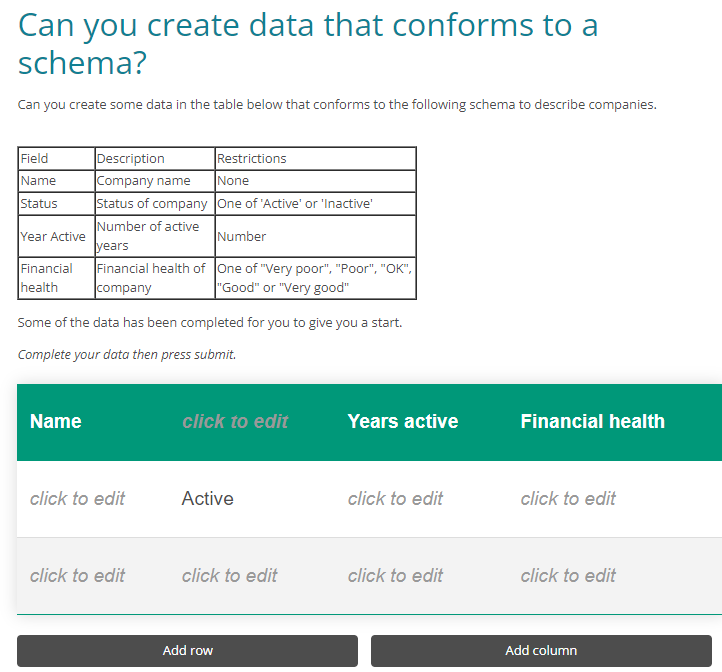

# adapt-schema-tableq

**Schema Table Question** is a question component developed by the Open Data Institute for the [Adapt framework](https://github.com/adaptlearning/adapt_framework) and [Adapt authoring tool](https://github.com/adaptlearning/adapt_authoring). This component allows learners to create data that conforms to a specified schema or description. The learner uses a table interface to enter data, which is then validated against the schema.

## Installation

To use the **Schema Table Question** plugin, follow these steps:

1. Manually install the plugin into your Adapt authoring tool.
2. Ensure compatibility with the latest version of the authoring tool.

## Usage

The **Schema Table Question** component utilizes attributes defined in the `properties.schema` file, which is included for reference. Here are some key attributes:

- **instruction** (string): Provides an instruction or prompt for the learner. Default: "Complete your data then press submit."
- **ariaQuestion** (string): A text read by screen readers instead of the display title, body, and instruction fields when focusing on the table options. Should be clear and concise, focusing only on the associated question.
- **schema** (file): The JSON schema against which the user's answer is validated. This attribute accepts an asset in the form of an uploaded file.
- **rows** (number): Specifies the number of rows (excluding headers) in the table. Learners can expand the table if needed. Default: 2.
- **requiredRows** (number): Specifies the number of rows that are required to have data before the user can submit their answer. Default: 2.
- **maxRows** (number): Sets the maximum number of rows (excluding headers) allowed in the table. Default: 4.
- **columns** (number): Defines the number of columns in the table. Learners can expand the table if needed. Default: 2.
- **placeholderText** (string): Specifies a placeholder text for empty cells in the table. Default: ""
- **sample** (file): A CSV file containing a sample, or subset, of the data which is shown to get people started.
- **modelAnswer** (file): A CSV file containing a model answer.

The **Schema Table Question** component also inherits attributes from the standard Adapt Multiple Choice Question (MCQ) component, such as:

Refer to the `properties.schema` file for a complete list of attributes and their descriptions.

## Accessibility

The **Schema Table Question** component supports accessibility features, including:

- ARIA labels: The component has descriptive labels using the `aria-label` attribute to improve accessibility for screen readers.
- ARIA Live Region: When the Correct Answer button is toggled by the learner, Adapt Framework v5.12.0 (or newer) can announce the correct/learner answer to screen readers using an ARIA Live Region. This feature enhances the user experience for learners relying on assistive technology.

## Limitations

When used with a LMS via SCORM only the result (correct/incorrect) is stored. The user data entered in the table is sent the a SCORM LMS as part of the interactions object. User answer is stored/restored from a cookie, however this is limited.

XAPI works as expected and user input is restored on revisit. 

----------------------------

**Author / Maintainer:** Open Data Institute

For more information about the **Schema Table Question** component, refer to the [Open Data Institute's GitHub repository](https://github.com/opendatainstitute/adapt-schema-tableq).

